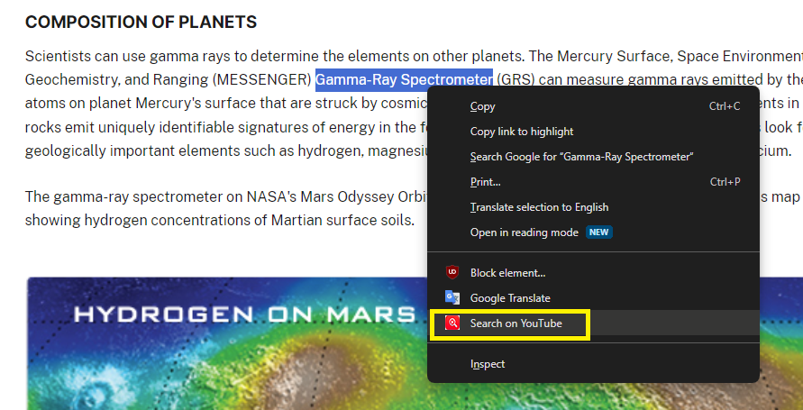

# chrome-extension-search-on-youtube
Right click highlighted text and "search on Youtube", just like "search on Google"

### Link to the Chrome Extension
Install it from here : ```https://chromewebstore.google.com/detail/search-on-youtube/bocecfgiliggfjjnkgolpekipdjbhlcm```

### Context and Purpose
Sometimes you read something and you want to look it up on Google; you have the *Search Google for "..."* option for that.

I wanted to replicate that but for Youtube, instead of having to copy the highlighted text, open Youtube and then paste and then click search.

This will do it all in one click.

### How it works
1. Highlight the text you want to search and click the context menu button "Search on Youtube"


It will automatically open what you searched for, in a new tab.


### Suggestions?
Open an issue here or leave it as a comment/review on the Chrome extension's page
